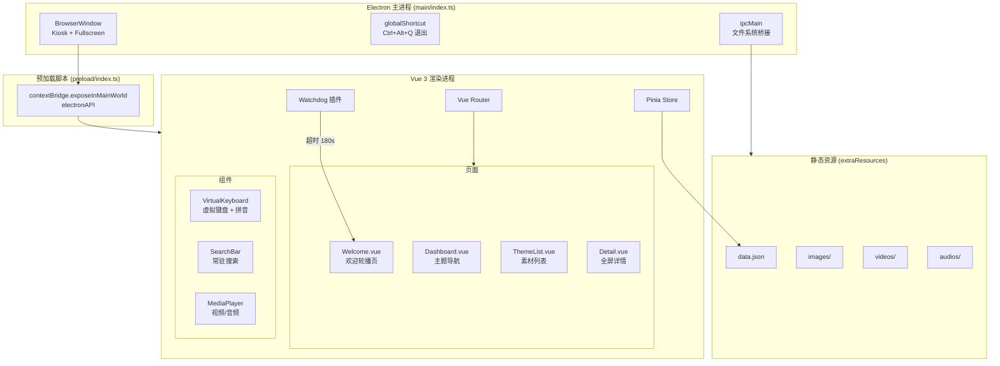

# 奉化 — 在地文化数字共创平台（一阶段离线大屏展示系统）

## 概述

基于 Vue 3 + Vite (electron-vite) + Electron 技术栈，为"奉化"开发一套**纯离线**大屏触摸展示系统。部署于 Windows 1080p（1920×1080）触摸一体机上，以 Kiosk 模式运行，支持全屏沉浸式浏览五大文化主题素材。

---

## 用户审阅要点

> [!IMPORTANT]
> **安全模型选择**：出于 Kiosk 场景的特殊需求（需要直接读取本地 `static/` 目录下的媒体资源），用户需求中指定了 `nodeIntegration: true, contextIsolation: false`。为了兼顾安全性与便利性，**本计划采用折中方案**：使用 `contextIsolation: true` + `preload` 脚本，通过 IPC 暴露受限的文件系统访问 API。如果用户希望简化实现，可以改回 `nodeIntegration: true` 方案。

> [!IMPORTANT]
> **拼音输入法**：虚拟键盘将集成 `simple-keyboard` 库 + 内置精简拼音词库（约 6000 常用字）。这是离线场景下最可控的方案。如果用户对拼音输入精度有更高要求，可以考虑集成更完整的 IME 引擎（如 `pinyin-pro`），但会增加包体积约 2-3 MB。

> [!WARNING]
> **Windows 系统快捷键拦截**：Electron 的 `globalShortcut` 能拦截大部分快捷键（Alt+Tab、Alt+F4 等），但**无法拦截 Ctrl+Alt+Del**。完全阻断需要 Windows 注册表/组策略配合（属于运维部署范畴，不在本代码交付范围内）。

---

## 开放问题

> [!IMPORTANT]
> 1. **TypeScript vs JavaScript**：`electron-vite` 默认支持 TypeScript 模板。考虑到 Kiosk 应用的稳定性需求，**建议使用 TypeScript** 以获得更好的类型安全。用户是否同意使用 TypeScript？
> 2. **拼音引擎选型**：方案 A（`pinyin-pro` 全功能拼音库，~3MB）vs 方案 B（自建精简映射表，~500KB，仅覆盖常用字）。用户偏好哪个？
> 3. **data.json 示例数据**：是否需要为五大主题各生成若干条模拟数据，以便演示和测试？
> 4. **占位图片/视频**：开发阶段是否需要生成一些占位媒体素材？

---

## 技术选型

| 项目 | 方案 | 说明 |
|------|------|------|
| 脚手架 | `electron-vite` (create @quick-start/electron) | 开箱即用的 main/preload/renderer 三进程构建 |
| 前端框架 | Vue 3 + Composition API | 现代化响应式开发 |
| 路由 | Vue Router 4 | SPA 页面切换 + 过渡动效 |
| 状态管理 | Pinia | 全局搜索状态、看门狗状态、主题数据缓存 |
| 虚拟键盘 | `simple-keyboard` | 成熟稳定、可深度定制 UI |
| 拼音引擎 | `pinyin-pro`（推荐）或自建映射 | 离线拼音联想 |
| 构建打包 | `electron-builder` (NSIS) | 一键生成 Windows .exe 安装包 |
| 样式方案 | Vanilla CSS + CSS 变量 | 不依赖外部框架，纯离线兼容 |

---

## 项目目录结构

```
tongshan-stage1/
├── electron.vite.config.ts          # electron-vite 构建配置
├── electron-builder.yml             # electron-builder 打包配置
├── package.json
├── tsconfig.json
├── tsconfig.node.json
├── tsconfig.web.json
│
├── resources/                        # Electron 构建资源（图标等）
│   └── icon.png
│
├── static/                           # 【核心】离线媒体资源目录（打包为 extraResources）
│   ├── data.json                     # 结构化数据
│   ├── images/                       # 图片素材
│   │   ├── welcome/                  # 欢迎页轮播图
│   │   ├── covers/                   # 素材封面图
│   │   └── themes/                   # 主题入口卡片背景
│   ├── videos/                       # 视频素材
│   └── audios/                       # 音频素材
│
├── src/
│   ├── main/                         # Electron 主进程
│   │   └── index.ts                  # 主窗口创建、Kiosk 配置、快捷键注册
│   │
│   ├── preload/                      # 预加载脚本
│   │   └── index.ts                  # IPC 桥接，暴露安全的文件系统 API
│   │
│   └── renderer/                     # Vue 渲染进程
│       ├── index.html
│       └── src/
│           ├── main.ts               # Vue 应用入口
│           ├── App.vue               # 根组件（含全局过渡动效）
│           │
│           ├── router/
│           │   └── index.ts          # 路由配置
│           │
│           ├── stores/
│           │   ├── dataStore.ts      # 数据层：加载 data.json、模糊搜索
│           │   └── appStore.ts       # 应用状态：当前主题、搜索词、键盘显隐
│           │
│           ├── plugins/
│           │   └── watchdog.ts       # 看门狗超时重置插件
│           │
│           ├── composables/
│           │   ├── useStaticPath.ts  # 静态资源路径解析
│           │   └── usePinyin.ts      # 拼音引擎封装
│           │
│           ├── views/
│           │   ├── Welcome.vue       # 欢迎页（轮播 + 准入交互 + 隐藏退出）
│           │   ├── Dashboard.vue     # 主题导航网格
│           │   ├── ThemeList.vue     # 二级素材列表（画廊书册风格）
│           │   └── Detail.vue        # 全屏素材详情（视频/音频/图文）
│           │
│           ├── components/
│           │   ├── CarouselSlider.vue     # 无缝循环轮播
│           │   ├── ThemeCard.vue          # 主题入口卡片
│           │   ├── MaterialCard.vue       # 素材卡片
│           │   ├── MediaPlayer.vue        # 视频/音频播放器
│           │   ├── SearchBar.vue          # 常驻搜索栏
│           │   ├── VirtualKeyboard.vue    # 虚拟键盘（含拼音候选栏）
│           │   ├── SearchResults.vue      # 搜索结果瀑布流
│           │   └── ImageViewer.vue        # 图片全屏查看器
│           │
│           └── styles/
│               ├── index.css         # 全局基础样式 + CSS 变量
│               ├── transitions.css   # 过渡动效定义
│               └── keyboard.css      # 虚拟键盘自定义样式
│
└── dev-app-update.yml
```

---

## 架构设计



---

## 功能模块详细设计

### 模块 1：Electron 主进程 (main/index.ts)

#### [NEW] [index.ts](file:///Users/tangruibin/Documents/Projects/tongshan/stage1/src/main/index.ts)

**核心职责：**
- 创建 Kiosk 全屏 BrowserWindow
- 注册管理员退出快捷键 `Ctrl+Alt+Q`
- 拦截系统快捷键（Alt+Tab、Alt+F4 等）
- 处理 IPC 请求：读取 `static/` 目录的文件
- 阻止新窗口弹出、右键菜单、页面导航

```typescript
// 关键配置
const win = new BrowserWindow({
  width: 1920, height: 1080,
  kiosk: true, fullscreen: true, frame: false,
  autoHideMenuBar: true, resizable: false,
  alwaysOnTop: true, skipTaskbar: true,
  webPreferences: {
    preload: join(__dirname, '../preload/index.js'),
    contextIsolation: true,
    nodeIntegration: false,
    devTools: !app.isPackaged
  }
})
```

---

### 模块 2：预加载脚本 (preload/index.ts)

#### [NEW] [index.ts](file:///Users/tangruibin/Documents/Projects/tongshan/stage1/src/preload/index.ts)

通过 `contextBridge` 暴露安全 API：
- `electronAPI.getStaticPath()` — 获取 `static/` 绝对路径
- `electronAPI.readDataJson()` — 读取并解析 `data.json`
- `electronAPI.resolveAsset(relativePath)` — 将相对路径转为可用的 `file://` URL
- `electronAPI.closeApp()` — 关闭应用（供隐藏退出区使用）

---

### 模块 3：欢迎页 (Welcome.vue)

#### [NEW] [Welcome.vue](file:///Users/tangruibin/Documents/Projects/tongshan/stage1/src/renderer/src/views/Welcome.vue)

**功能实现：**

1. **全屏轮播**
   - 使用 `CarouselSlider` 组件，从 `data.json` 配置或 `static/images/welcome/` 目录读取图片
   - 每 5 秒自动切换，纯 CSS `opacity` 过渡动效（700ms 淡入淡出）
   - 无缝循环：末尾追加首图副本

2. **准入交互**
   - 全屏覆盖透明点击层
   - 点击任意位置 → `opacity 0` → 300ms 延迟 → `router.push('/dashboard')` → 新页面 `opacity 1`
   - 使用 Vue Router 内置 `<Transition>` 组件

3. **隐藏退出区**
   - 右上角 80×80px 不可见 `<div>`
   - 500ms 内连续 5 次点击 → 调用 `electronAPI.closeApp()`
   - 使用 `setTimeout` 做连击重置

---

### 模块 4：主题导航 (Dashboard.vue)

#### [NEW] [Dashboard.vue](file:///Users/tangruibin/Documents/Projects/tongshan/stage1/src/renderer/src/views/Dashboard.vue)

**布局设计（1920×1080）：**

```
┌──────────────────────────────────────────────────────┐
│  顶部标题栏 (100px)                                    │
│  "奉化 · 在地文化数字共创平台"                      │
├──────────────────────────────────────────────────────┤
│                                                      │
│  ┌────────┐  ┌────────┐  ┌────────┐                  │
│  │ 水蜜桃  │  │  弥勒   │  │  民国   │                  │
│  │        │  │        │  │        │   主题卡片网格     │
│  └────────┘  └────────┘  └────────┘   (5 列自适应)     │
│  ┌────────┐  ┌────────┐                              │
│  │  宋韵   │  │  非遗   │                              │
│  │        │  │        │                              │
│  └────────┘  └────────┘                              │
│                                                      │
├──────────────────────────────────────────────────────┤
│  底部搜索栏 (80px) [常驻]        🔍 搜索作品、作者、标签… │
└──────────────────────────────────────────────────────┘
```

**交互细节：**
- 5 个主题入口使用高品质背景图 + 毛玻璃遮罩 + 标题文字
- Hover/Touch 态：卡片微上浮 + 阴影增强 + 放大 1.03 倍
- 点击 → 淡入淡出切换至 `ThemeList` 页

---

### 模块 5：素材列表 (ThemeList.vue)

#### [NEW] [ThemeList.vue](file:///Users/tangruibin/Documents/Projects/tongshan/stage1/src/renderer/src/views/ThemeList.vue)

**画廊书册风格排版：**
- 顶部：面包屑导航 + 当前主题名称
- 主体：2 行 × 4 列 卡片网格（可纵向滚动）
- 每张卡片：封面图 + 标题 + 作者 + 类型标签（视频/图片/音频/文字）
- 点击卡片 → 弹出全屏 `Detail` 详情视图
- 底部：常驻搜索栏（与 Dashboard 共享组件）

---

### 模块 6：全屏详情 (Detail.vue)

#### [NEW] [Detail.vue](file:///Users/tangruibin/Documents/Projects/tongshan/stage1/src/renderer/src/views/Detail.vue)

**根据素材类型渲染不同内容：**

| 类型 | 渲染方式 |
|------|----------|
| `video` | 全屏 `<video>` 播放器，自定义控制栏（播放/暂停/进度/音量） |
| `audio` | 音频波形可视化 + 封面图背景 + 控制栏 |
| `image` | 全屏图片展示，支持双指缩放（touch-action: pinch-zoom） |
| `text` | 图文混排：左侧封面图 + 右侧竖排/横排文字内容 |

- 右上角关闭按钮（大触摸区 60×60px）
- 淡入淡出动效进出

---

### 模块 7：搜索系统 (SearchBar.vue + VirtualKeyboard.vue + SearchResults.vue)

#### [NEW] [SearchBar.vue](file:///Users/tangruibin/Documents/Projects/tongshan/stage1/src/renderer/src/components/SearchBar.vue)

- 固定于页面底部 80px 高度
- 点击输入框 → 从底部弹出虚拟键盘
- 实时将输入词传递给 Pinia Store 执行模糊搜索

#### [NEW] [VirtualKeyboard.vue](file:///Users/tangruibin/Documents/Projects/tongshan/stage1/src/renderer/src/components/VirtualKeyboard.vue)

- 基于 `simple-keyboard` 封装
- **三种布局**：英文 QWERTY、数字、拼音（实际上也是 QWERTY，只是启用拼音引擎）
- **拼音候选栏**：键盘上方 50px 高横向滚动区，显示候选汉字/词
- 点击候选词 → 插入搜索框
- 从底部 `transform: translateY` 弹入弹出，300ms ease 过渡

#### [NEW] [SearchResults.vue](file:///Users/tangruibin/Documents/Projects/tongshan/stage1/src/renderer/src/components/SearchResults.vue)

- 搜索结果浮层，覆盖在主内容上方
- 瀑布流/网格列表展示匹配结果
- 点击结果项 → 全屏 Detail 详情

#### 模糊搜索逻辑 (dataStore.ts)

```typescript
// Pinia Store 中的搜索方法
function fuzzySearch(keyword: string): Material[] {
  const kw = keyword.toLowerCase().trim()
  if (!kw) return []

  return materials.value.filter(m => {
    // 多条件并集匹配：标题、作者、标签
    return m.title.toLowerCase().includes(kw)
      || m.author.toLowerCase().includes(kw)
      || m.tags.some(t => t.toLowerCase().includes(kw))
      || m.theme.toLowerCase().includes(kw)
  })
}
```

---

### 模块 8：看门狗插件 (watchdog.ts)

#### [NEW] [watchdog.ts](file:///Users/tangruibin/Documents/Projects/tongshan/stage1/src/renderer/src/plugins/watchdog.ts)

**实现为 Vue 插件 / Composable：**

```typescript
// 核心逻辑
const TIMEOUT = 180_000 // 180 秒

function installWatchdog(app, router) {
  let timer: ReturnType<typeof setTimeout>

  const reset = () => {
    clearTimeout(timer)
    timer = setTimeout(() => {
      // 超时处理：
      // 1. 暂停所有媒体播放
      // 2. 清除搜索状态
      // 3. 关闭所有弹层
      // 4. 淡出跳转至 Welcome 页
      router.push('/')
    }, TIMEOUT)
  }

  // 监听所有交互事件
  const events = ['pointerdown', 'pointermove', 'click', 'keydown', 'touchstart']
  events.forEach(e => document.addEventListener(e, reset, { passive: true }))

  reset() // 初始启动
}
```

---

### 模块 9：路由配置 (router/index.ts)

#### [NEW] [index.ts](file:///Users/tangruibin/Documents/Projects/tongshan/stage1/src/renderer/src/router/index.ts)

```typescript
const routes = [
  { path: '/', name: 'Welcome', component: () => import('../views/Welcome.vue') },
  { path: '/dashboard', name: 'Dashboard', component: () => import('../views/Dashboard.vue') },
  { path: '/theme/:themeName', name: 'ThemeList', component: () => import('../views/ThemeList.vue') },
  { path: '/detail/:id', name: 'Detail', component: () => import('../views/Detail.vue') }
]
```

全局路由切换动效：使用 `<RouterView v-slot>` + `<Transition name="fade">` 统一管理淡入淡出。

---

### 模块 10：构建与打包配置

#### [MODIFY] [package.json](file:///Users/tangruibin/Documents/Projects/tongshan/stage1/package.json)

```json
{
  "scripts": {
    "dev": "electron-vite dev",
    "build": "electron-vite build",
    "build:win": "npm run build && electron-builder --win --config electron-builder.yml"
  }
}
```

#### [NEW] [electron-builder.yml](file:///Users/tangruibin/Documents/Projects/tongshan/stage1/electron-builder.yml)

```yaml
appId: com.tongshan.culture-platform
productName: 文化展示
copyright: Copyright © 2026 奉化
directories:
  output: dist-release

extraResources:
  - from: "static"
    to: "static"
    filter:
      - "**/*"

win:
  target:
    - nsis
  icon: resources/icon.ico
  artifactName: "${productName}-Setup-${version}.${ext}"

nsis:
  oneClick: true
  perMachine: true
  allowToChangeInstallationDirectory: false
  createDesktopShortcut: true
  runAfterFinish: true
  shortcutName: 文化展示
```

---

## UI 设计方案

### 视觉风格

- **色彩体系**：以宋韵雅致为基调
  - 主色：`#2D1B14`（深栗色/古木色）
  - 辅色：`#C4956A`（暖金/琥珀色）
  - 背景：`#0D0D0D`（深夜墨黑）→ `#1A1A2E`（靛蓝墨黑）渐变
  - 文字：`#F5F0E8`（米白/宣纸色）
  - 强调色：`#E8B86D`（金箔色）

- **字体**：使用系统内置宋体/黑体（`"Noto Serif SC", "SimSun", "Microsoft YaHei", serif`），不依赖在线字体

- **动效规范**：
  - 页面切换：`opacity` 过渡，`400ms ease-in-out`
  - 卡片交互：`transform: scale(1.03) translateY(-4px)`，`250ms ease`
  - 键盘弹出：`transform: translateY(0)`，`300ms cubic-bezier(0.4, 0, 0.2, 1)`

### 触摸适配

- 所有可点击元素最小 44×44px
- 卡片间距 ≥ 16px
- 滚动区域使用 `-webkit-overflow-scrolling: touch`
- 禁用文本选择和拖拽（`user-select: none; -webkit-user-drag: none`）

---

## 验证计划

### 自动化测试

```bash
# 1. 项目构建验证
npm run build

# 2. 开发模式启动测试
npm run dev

# 3. Windows 打包测试
npm run build:win
```

### 手动验证清单

| 场景 | 验证方式 |
|------|----------|
| Kiosk 全屏 | 启动后确认无标题栏、无任务栏、全屏显示 |
| 欢迎页轮播 | 确认图片循环播放、淡入淡出流畅 |
| 隐藏退出 | 右上角连击 5 次确认关闭 |
| 主题导航 | 点击 5 个主题卡片均可正确跳转 |
| 素材列表 | 确认按主题过滤数据正确 |
| 视频播放 | 全屏播放高码率本地视频，确认流畅 |
| 虚拟键盘 | 确认弹出/收起动效、英文/拼音输入 |
| 模糊搜索 | 多条件搜索验证匹配准确性 |
| 看门狗 | 静置 180 秒后确认自动返回欢迎页 |
| Ctrl+Alt+Q | 确认管理员快捷键可安全退出 |

---

## 实施步骤概览

1. **初始化项目**：使用 `electron-vite` 脚手架创建 Vue 3 项目
2. **配置主进程**：Kiosk 模式、IPC 通信、快捷键注册
3. **搭建预加载脚本**：安全 API 桥接
4. **建立样式系统**：CSS 变量、全局样式、过渡动效
5. **开发核心页面**：Welcome → Dashboard → ThemeList → Detail
6. **开发通用组件**：轮播、卡片、搜索栏、虚拟键盘、媒体播放器
7. **实现搜索系统**：Pinia Store + 模糊匹配 + 拼音引擎
8. **集成看门狗**：超时检测与自动重置
9. **准备示例数据**：data.json + 占位素材
10. **打包配置**：electron-builder 生成 Windows 安装包
11. **集成测试**：完整流程验证
